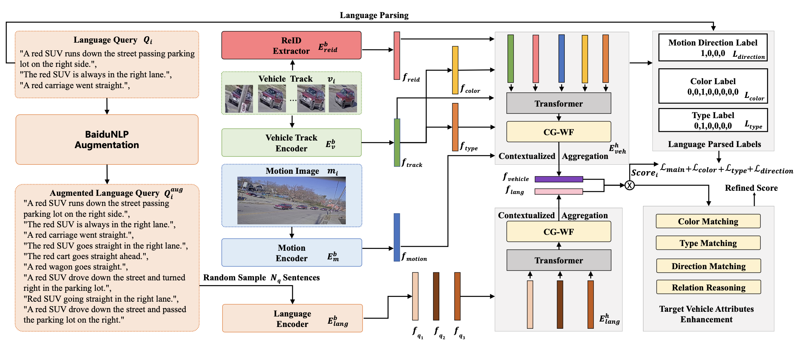

# A Multi-granularity Retrieval System for Natural Language-based Vehicle Retrieval

This repository contains the code for our CVRP2022 Workshop AI City Challenge Track-2 which we won the first place.

## Structure
Our code in this repository mainly contains the following modules:
- `srl_extraction`: Take the SRL tools to parse the nls of the train tracks and test queries.
- `srl_handler`: Further parse the results of SRL, and get the textual color, type, and direction labels, which are used in cross-modal similarity model learning and visual attribute classifiers training.
-  `classifier`: According to the textual color, type and direction labels of train dataset obtain by `srl_handler`, train several visual attribute classifiers, and predict visual track color, type and direction prediction of test dataset, which are used in the post-process module.
- `direction_refinement`: In order to test the upper bound of our model, we take some measures to improve our direction prediction. Please note that this part is only used to get the best visual direction prediction to test the upper bound, which is not our final submission.
- `post_process`: Add explicit constraints to do post-process and generate the final submission.
- `src`: The main part of our cross-modal retrieval model. Our cross-modal retrieval model refer to [Frozen in Time: A Joint Video and Image Encoder for End-to-End Retrieval](https://arxiv.org/abs/2104.00650).

## Preparation
To reproduce our results, you need to prepare the necessary environment and data files.
For the environment, you can run the following command to prepare the environment:
```
pip install -r requirements.txt
```
Please note that, this project also some pretrained model weights like distilbert-base-uncased, efficientnet-b5 ..., so please make sure that your machine has the network connection to download these weight files, and these files will saved in your cache folder. 

For the data, our data files have the following structure:
```
aicity
├── annotations
│   ├── all_track_to_query.txt
│   ├── relation_info_back_test.json
│   ├── relation_info_front_test.json
│   ├── test_queries_aug.json
│   ├── test-queries-correct.json
│   ├── test_queries.json
│   ├── test_tracks_crop.json
│   ├── test_tracks_crop_with_motion_clips.json
│   ├── test_tracks_crop_with_motion_clips_nl.json
│   ├── test_tracks.json
│   ├── train_tracks_aug.json
│   ├── train-tracks-correct.json
│   ├── train_tracks_crop.json
│   ├── train_tracks_crop_with_id_motion_clips_colors_types_direction.json
│   ├── train_tracks_crop_with_id_motion_clips_colors_types_nl_aug_direction.json
│   ├── train_tracks_crop_with_id_motion_clips_colors_types_nl_aug.json
│   ├── train_tracks_crop_with_id_motion_clips.json
│   └── train_tracks.json
├── motions
│   ├── 0009129f-df48-49c0-a41b-bf94a09410a0.jpg
│   ├── 00165c2d-b937-4009-aa71-531512d1dd57.jpg
│   ├── 001c43fe-d0b9-4f6b-a95f-8459938eb17e.jpg
│   ├── ...
├── reid
│   └── track2_reid_features.pkl
├── tracks
│   ├── 0009129f-df48-49c0-a41b-bf94a09410a0
│   ├── 00165c2d-b937-4009-aa71-531512d1dd57
│   ├── 001c43fe-d0b9-4f6b-a95f-8459938eb17e
│   ├── ...
```
Please note that, we generate the motion images and cropped tracked vehicle images from the raw video frames, and take this as our training data. We also get the Reid feature for the track2 dataset, use our Reid model from. In the annotation folder, we convert the original files into the format our model needs.  You can download these files in:
- `reid`: (https://pan.baidu.com/s/1BZdWKysfIYEK4CI9_x3JsQ?pwd=nh89 code: nh89)
- `motion`:(https://pan.baidu.com/s/17LIMTh9dHU27izczaAY5Fw?pwd=t7qt code: t7qt)
- `tracks`:(https://pan.baidu.com/s/1Nq-W6z4IBrpzzor94f5YUA?pwd=trgm code: trgm)
- `annotations`:(https://pan.baidu.com/s/1MxfZNXtF5owy8t2v3Fe4og?pwd=ni7e code: ni7e)

## Training
1. Do the srl_extraction for train and test dataset, see [srl_extraction](./srl_extraction/README.md) for more details.

2. Do the srl_handle to get the fine-grain attribute labels of textual nl queries, see [srl_handler](./srl_handler/README.md) for more details.

3. Train the visual attribute classifier and predict the visual attribute for test tracks, see [classifier](./classifier/README.md) for more details.

4. Train and extract Reid features. In our model, we also take the Reid features of the tracked vehicles as our input, so we should first train a Reid model with track2 data. see [reid](./reid/README.md) for more details.

5. Train the cross-modal retrieval model. If you just want to verify our model, all the necessary files are already provided in the above links, you can simply run the following command to train the cross-model retrieval model:
    ```
    python train.py -c configs/cityflow/cityflow_frozen_cg-wg.json
    ```
    The training log and checkpoint files will be saved in the `record/models`. You can also train our model after running the above steps to generate the annotation files by yourself.

6. Model ensemble. In order to further boost our performance, we run our model several times or trained several models with different configs(e.g. lr, batch_size)  and then did the model ensemble according to the method proposed in [Model soups: averaging weights of multiple fine-tuned models improves accuracy without increasing inference time](https://arxiv.org/abs/2203.05482). 
    ```
    cd model_soup
    python model_soup.py configs/cityflow/cityflow_frozen_cg-wg.json
    ```
    The model_soup will take the average several model checkpoint files as the the final model weight, and the ensemble model weight will be saved in `record/model_soup`. You can also download our saved checkpoint files in [checkpoint-soup](https://pan.baidu.com/s/1ipp6S2eNjzPt7NW4mLq7-g?pwd=9h9a code: 9h9a) to reproduce our result. 

7. Inference with the ensemble model checkpoint file, and put this file in the root folder. Then, to get the similarity matrix of test dataset, run the command:
    ```
    python inference.py -c record/models/cityflow_frozen_cg-wf/1/config.json -r record/model_soup/ 
    ```
    the coarse similarity matrix will be saved in `sim_mats`.


8. [Optional] Refine the direction prediction. In order to test the upper bound of our model, we take the measure of drawing road masks to refine the test direction prediction. Please note that our final submission `did not use` this direction refinement result. see [direction_refinement](./direction_refinement/README.md) for more details.

9. Do the post-process and get the final submission. Our post-process mainly consist of two parts, in post-process-part1, we take the target vehicle's various attributes information like color, type and motion, and it's related vehicles attributes information to re-score the original similarity matrix. And in the post-process-part2, we use some specific scene information like s-bent, parking spot to re-score the similarity matrix. see [post-process](./post_process/README.md) for more details. 

## Acknowledgements
The structure of this repository is based on https://github.com/princetonvisualai/MQVR.
